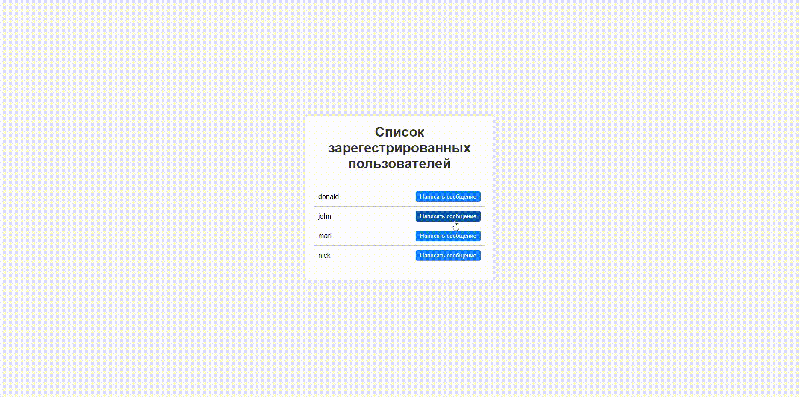
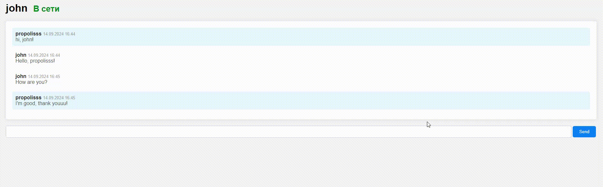
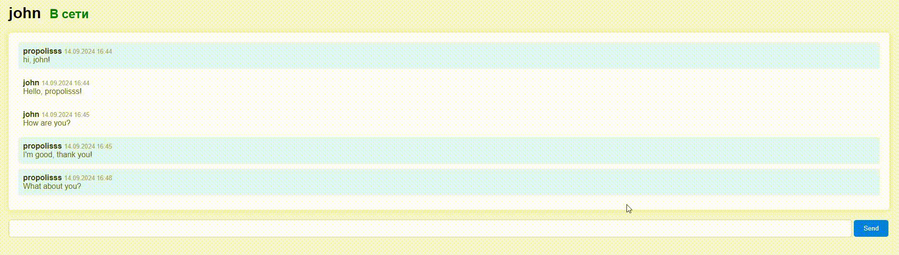
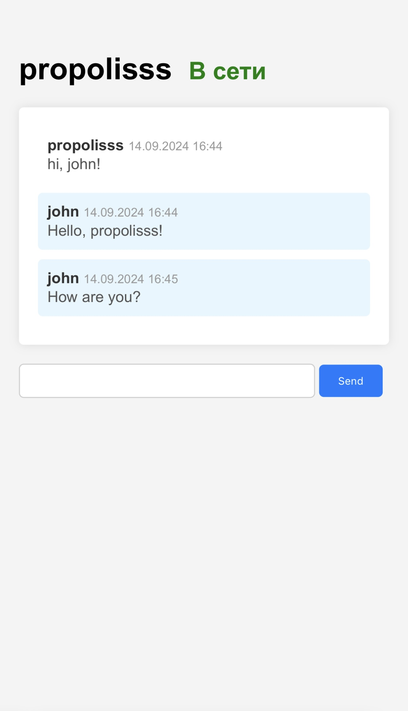

<a id="readme-top"></a>

[![Contributors][contributors-shield]][contributors-url]
[![Forks][forks-shield]][forks-url]
[![Stargazers][stars-shield]][stars-url]
[![Issues][issues-shield]][issues-url]
[![MIT License][license-shield]][license-url]

<br />
<div align="center">
  <h3 align="center">MessenFlow</h3>

  <p align="center">
    A simple messenger application built with Go, supporting user registration, login, message sending, editing, and deleting.
    <br />
    <a href="https://github.com/Propolisss/MessenFlow"><strong>Explore the docs »</strong></a>
    <br />
    <br />
    ·
    <a href="https://github.com/Propolisss/MessenFlow/issues/new?labels=bug&template=bug-report---.md">Report Bug</a>
    ·
    <a href="https://github.com/Propolisss/MessenFlow/issues/new?labels=enhancement&template=feature-request---.md">Request Feature</a>
  </p>
</div>

<!-- TABLE OF CONTENTS -->
<details>
  <summary>Table of Contents</summary>
  <ol>
    <li>
      <a href="#about-the-project">About The Project</a>
      <ul>
        <li><a href="#application-functionality">Application Functionality</a></li>
        <li><a href="#built-with">Built With</a></li>
      </ul>
    </li>
    <li>
      <a href="#getting-started">Getting Started</a>
      <ul>
        <li><a href="#prerequisites">Prerequisites</a></li>
        <li><a href="#installation">Installation</a></li>
      </ul>
    </li>
    <li><a href="#usage">Usage</a></li>
    <li><a href="#roadmap">Roadmap</a></li>
    <li><a href="#contributing">Contributing</a></li>
    <li><a href="#license">License</a></li>
  </ol>
</details>

<!-- ABOUT THE PROJECT -->

## About The Project

MessenFlow is a basic yet functional messenger application that allows users to register, log in, and chat with others.
Users can send, edit, and delete their own messages in real-time, leveraging WebSocket for instant communication. The
backend is powered by Go, with a simple frontend built using HTML, CSS, and JavaScript. SQLite is used for data storage,
keeping the application lightweight and easy to set up.

## Application Functionality

### Log in

Below is an example of the login process:

|  |
|:---------------------------:|
|       *Login process*       |

### Chatting

Example of interaction in the chat:

|  |
|:-------------------------------:|
|       *Chat interaction*        |

### Updating Message

Shows how to update a message:

|  |
|:---------------------------------------:|
|          *Updating a message*           |

### Deleting Message

Example of deleting a message:

|  |
|:---------------------------------------:|
|          *Deleting a message*           |

### Mobile Screen

Here's how the application looks on a mobile device:

|  |
|:----------------------------------:|
|   *Application on mobile screen*   |

<p align="right">(<a href="#readme-top">back to top</a>)</p>

## Features

- Real-time messaging using WebSocket
- User registration and authentication
- Edit and delete messages

<p align="right">(<a href="#readme-top">back to top</a>)</p>

### Built With

* [![Go][Go-pic]][Go-url]
* [![Websocket][Websocket-pic]][WebSocket-url]
* [![SQLite][SQLite-pic]][SQLite-url]
* [![HTML5][HTML-pic]][HTML-url]
* [![CSS3][CSS-pic]][CSS-url]
* [![JavaScript][JS-pic]][JS-url]

<p align="right">(<a href="#readme-top">back to top</a>)</p>

<!-- GETTING STARTED -->

## Getting Started

To get a local copy of this project up and running, follow the steps below.

### Prerequisites

Ensure you have Go installed on your machine. You can download it from [Go's official website](https://golang.org/dl/).

### Installation

1. Clone the repository:
   ```sh
   git clone https://github.com/Propolisss/MessenFlow.git
   ```
2. Navigate to the project directory:
   ```sh
   cd MessenFlow
   ```
3. Build and run the project:
   ```sh
   go run main.go
   ```
4. Open your browser and navigate to `http://localhost:8080`.

<p align="right">(<a href="#readme-top">back to top</a>)</p>

<!-- USAGE EXAMPLES -->

## Usage

Once the server is running, you can register a new user, log in, and start sending messages to other registered users.
You can also edit or delete your messages.

<p align="right">(<a href="#readme-top">back to top</a>)</p>

<!-- ROADMAP -->

## Roadmap

- [ ] User authentication improvements
- [ ] Implementing user roles and permissions
- [ ] Adding file attachment support
- [ ] Enhance UI/UX with modern frameworks
- [ ] Add online/offline status
- [ ] Add voice and video messages
- [ ] Add password encryption
- [ ] Refactor chatID system

See the [open issues](https://github.com/Propolisss/MessenFlow/issues) for a full list of proposed features (and known
issues).

<p align="right">(<a href="#readme-top">back to top</a>)</p>

<!-- CONTRIBUTING -->

## Contributing

Contributions are what make the open source community an amazing place to learn, inspire, and create. Any contributions
you make are **greatly appreciated**.

If you have a suggestion that would make this project better, please fork the repo and create a pull request. You can
also simply open an issue with the tag "enhancement". Don't forget to give the project a star! Thanks again!

1. Fork the Project
2. Create your Feature Branch (`git checkout -b feature/AmazingFeature`)
3. Commit your Changes (`git commit -m 'Add some AmazingFeature'`)
4. Push to the Branch (`git push origin feature/AmazingFeature`)
5. Open a Pull Request

<p align="right">(<a href="#readme-top">back to top</a>)</p>

### Top contributors:

<a href="https://github.com/Propolisss/MessenFlow/graphs/contributors">
  
</a>

<!-- LICENSE -->

## License

Distributed under the MIT License. See `LICENSE.txt` for more information.

<p align="right">(<a href="#readme-top">back to top</a>)</p>

<!-- MARKDOWN LINKS & IMAGES -->

[contributors-shield]: https://img.shields.io/github/contributors/Propolisss/MessenFlow.svg?style=for-the-badge

[contributors-url]: https://github.com/Propolisss/MessenFlow/graphs/contributors

[forks-shield]: https://img.shields.io/github/forks/Propolisss/MessenFlow.svg?style=for-the-badge

[forks-url]: https://github.com/Propolisss/MessenFlow/network/members

[stars-shield]: https://img.shields.io/github/stars/Propolisss/MessenFlow.svg?style=for-the-badge

[stars-url]: https://github.com/Propolisss/MessenFlow/stargazers

[issues-shield]: https://img.shields.io/github/issues/Propolisss/MessenFlow.svg?style=for-the-badge

[issues-url]: https://github.com/Propolisss/MessenFlow/issues

[license-shield]: https://img.shields.io/github/license/Propolisss/MessenFlow.svg?style=for-the-badge

[license-url]: https://github.com/Propolisss/MessenFlow/blob/master/LICENSE.txt

[Go-pic]: https://img.shields.io/badge/Go-00ADD8?style=for-the-badge&logo=go&logoColor=white

[HTML-pic]: https://img.shields.io/badge/HTML5-E34F26?style=for-the-badge&logo=html5&logoColor=white

[JS-pic]: https://img.shields.io/badge/JavaScript-F7DF1E?style=for-the-badge&logo=javascript&logoColor=black

[CSS-pic]: https://img.shields.io/badge/CSS3-1572B6?style=for-the-badge&logo=css3&logoColor=white

[Websocket-pic]: https://img.shields.io/badge/WebSocket-007ACC?style=for-the-badge&logo=websocket&logoColor=white

[SQLite-pic]: https://img.shields.io/badge/SQLite-003B57?style=for-the-badge&logo=sqlite&logoColor=white

[Go-url]: https://golang.org/

[SQLite-url]: https://www.sqlite.org/

[WebSocket-url]: https://developer.mozilla.org/en-US/docs/Web/API/WebSockets_API

[HTML-url]: https://developer.mozilla.org/en-US/docs/Web/Guide/HTML/HTML5

[CSS-url]: https://developer.mozilla.org/en-US/docs/Web/CSS/CSS3

[JS-url]: https://developer.mozilla.org/en-US/docs/Web/JavaScript

---
